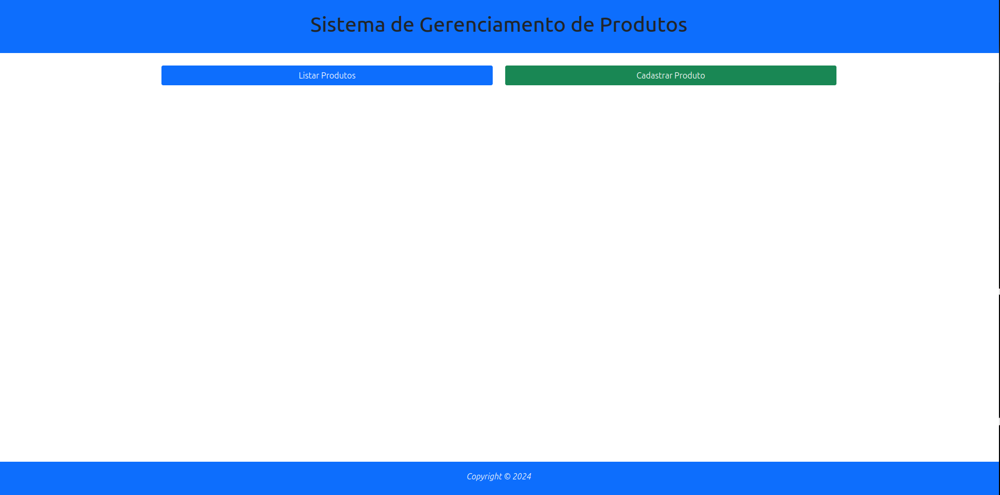
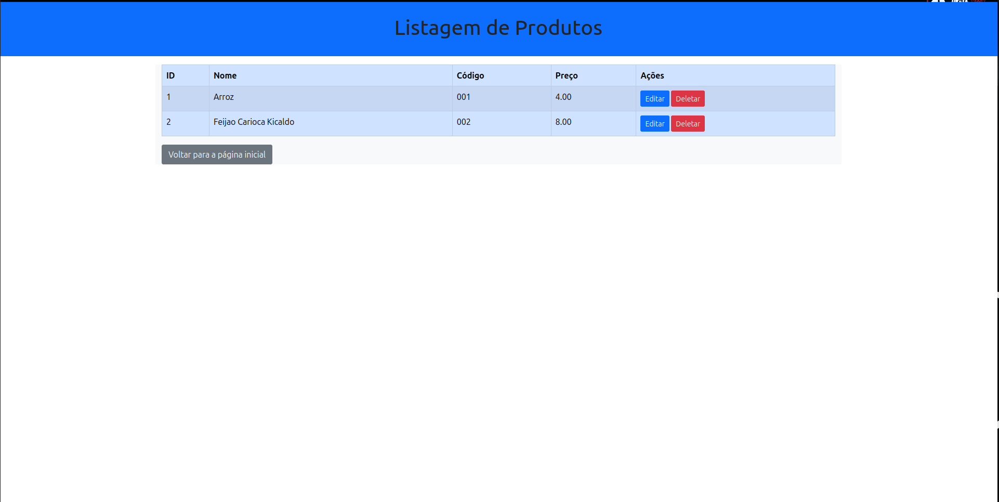
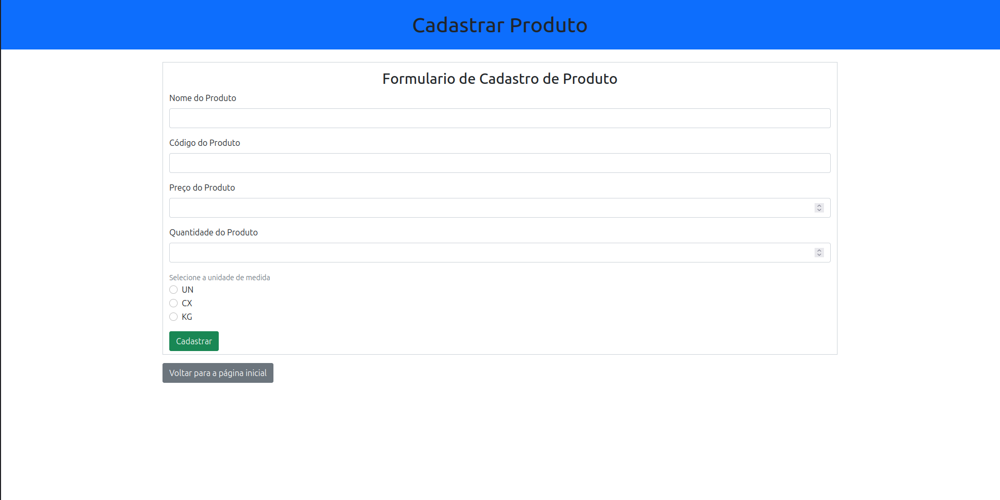
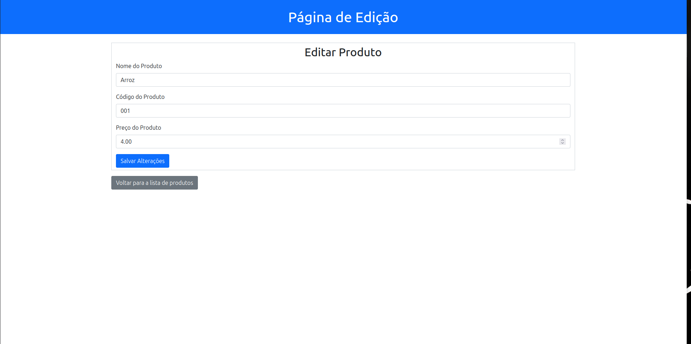

# Cadastro e Listagem de Produtos v1.0

Um sistema simples de gerenciamento de produtos desenvolvido em PHP usando arquitetura MVC (Model-View-Controller). Esta é a primeira versão do projeto, permitindo operações básicas de CRUD (Criar, Ler, Atualizar, Deletar) para produtos.

## Funcionalidades

- **Listar Produtos**: Visualizar todos os produtos cadastrados.
- **Cadastrar Produto**: Adicionar novos produtos com nome, preço, código e unidade de medida.
- **Editar Produto**: Modificar informações de produtos existentes.
- **Deletar Produto**: Remover produtos do sistema.

## Screenshots

Aqui estão algumas capturas de tela do sistema:

- **Página Inicial**: 
- **Listagem de Produtos**: 
- **Cadastrar Produto**: 
- **Editar Produto**: 

*Nota: As imagens devem ser adicionadas na pasta `screenshots/` do repositório.*

## Tecnologias Utilizadas

- **PHP**: Linguagem de programação principal.
- **MySQL**: Banco de dados para armazenamento de dados.
- **PDO**: Extensão PHP para acesso ao banco de dados.
- **Composer**: Gerenciador de dependências para autoloading.

## Pré-requisitos

Antes de executar o projeto, certifique-se de ter instalado:

- PHP 7.4 ou superior
- MySQL 5.7 ou superior
- Composer

## Instalação

1. **Clone o repositório**:
   ```bash
   git clone https://github.com/raposonaumpegue/cadastro_e_listagem_de_produtos.git
   cd cadastro_e_listagem_de_produtos
   ```

2. **Instale as dependências**:
   ```bash
   composer install
   ```

3. **Configure o banco de dados**:
   - Crie um banco de dados MySQL chamado `sistemaDeCadastroElistagem`.
   - Execute o seguinte script SQL para criar a tabela de produtos:
     ```sql
     CREATE TABLE produtos (
         id INT AUTO_INCREMENT PRIMARY KEY,
         nome VARCHAR(255) NOT NULL,
         preco DECIMAL(10, 2) NOT NULL,
         cod_produto VARCHAR(100) UNIQUE NOT NULL,
         un_medida VARCHAR(50) NOT NULL
     );
     ```
   - Importe o dump do banco de dados (se disponível):
     ```bash
     mysql -u estudante -p2467 sistemaDeCadastroElistagem < database/dump.sql
     ```
     *Substitua `estudante` e `2467` pelas suas credenciais do MySQL, se diferentes.*

4. **Configure as credenciais do banco**:
   - Edite o arquivo `config.php` e ajuste as configurações do banco de dados conforme necessário.

5. **Inicie o servidor**:
   - Navegue até a pasta `public` e execute:
     ```bash
     php -S localhost:8000
     ```
   - Ou configure um servidor web (como Apache ou Nginx) para apontar para a pasta `public`.

## Uso

Após a instalação, acesse `http://localhost:8000` no seu navegador.

- **Página Inicial**: `http://localhost:8000/`
- **Listar Produtos**: `http://localhost:8000/listar-produtos`
- **Cadastrar Produto**: `http://localhost:8000/cadastrar-produto`
- **Editar Produto**: `http://localhost:8000/editar-produto/{id}`
- **Deletar Produto**: `http://localhost:8000/deletar-produto/{id}`

## Estrutura do Projeto

```
cadastro_e_listagem_de_produtos/
├── app/
│   ├── controllers/
│   │   ├── HomeController.php
│   │   └── ProductController.php
│   ├── core/
│   │   ├── Controller.php
│   │   ├── Database.php
│   │   └── Router.php
│   ├── models/
│   │   ├── Model.php
│   │   └── products/
│   │       └── ProductModel.php
│   ├── routes/
│   │   └── web.php
│   └── views/
│       ├── layouts/
│       └── products/
│           ├── create.php
│           ├── edit.php
│           ├── home.php
│           └── list.php
├── database/
│   └── dump.sql
├── public/
│   ├── index.php
│   └── assets/
├── vendor/
├── bootstrap.php
├── composer.json
├── config.php
└── ReadMe.md
```

## Contribuição

Contribuições são bem-vindas! Sinta-se à vontade para abrir issues ou enviar pull requests.

## Autor

Desenvolvido por [dev.vinicius](https://github.com/raposonaumpegue).