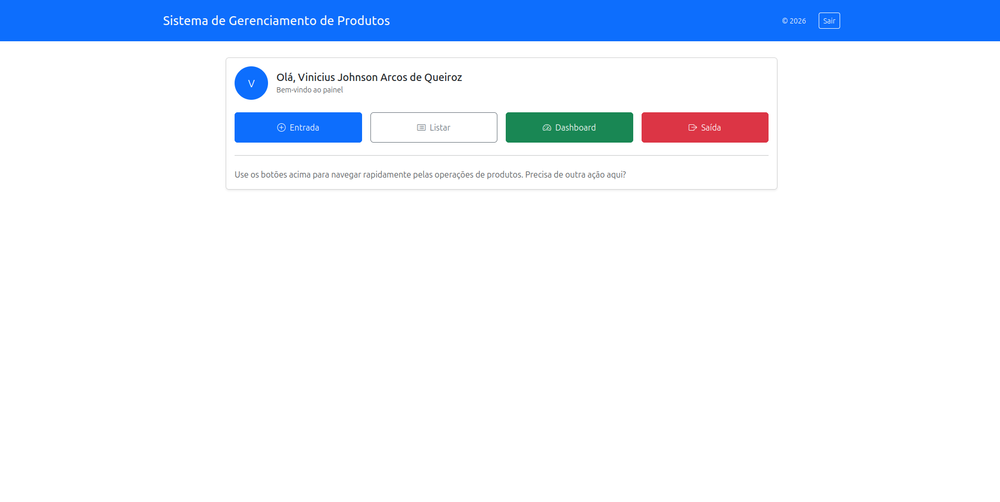
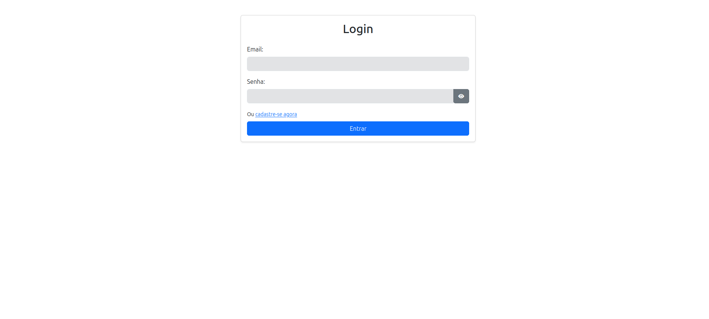
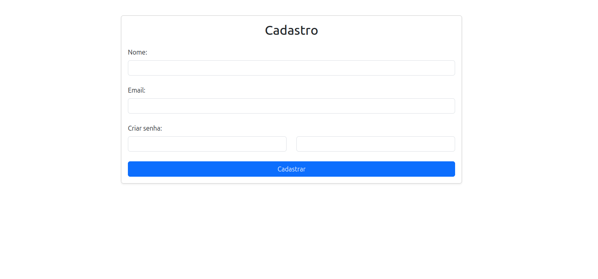
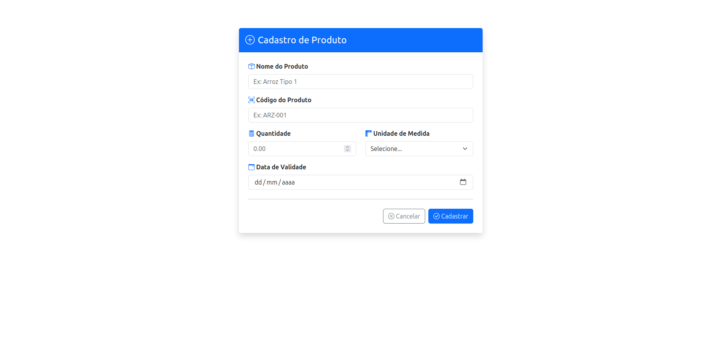
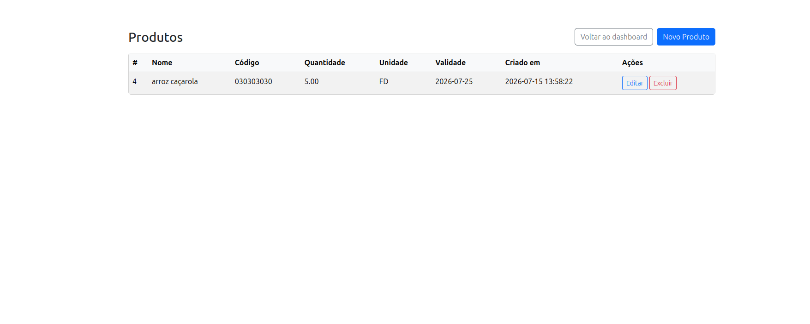
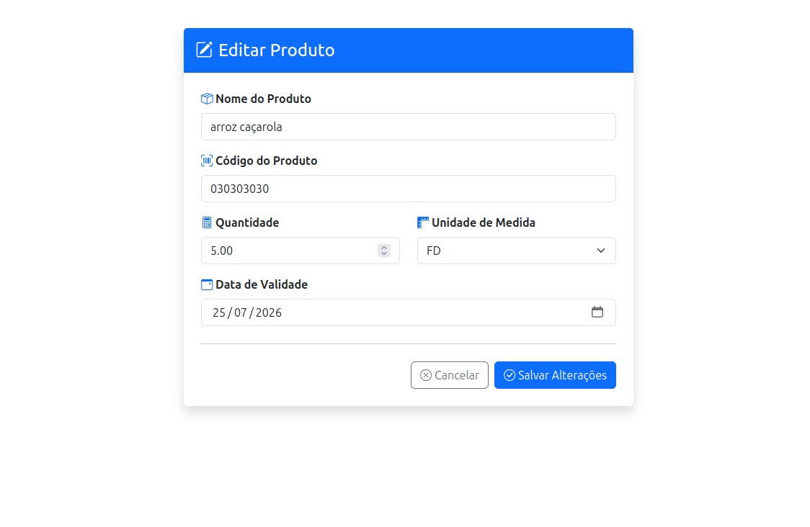
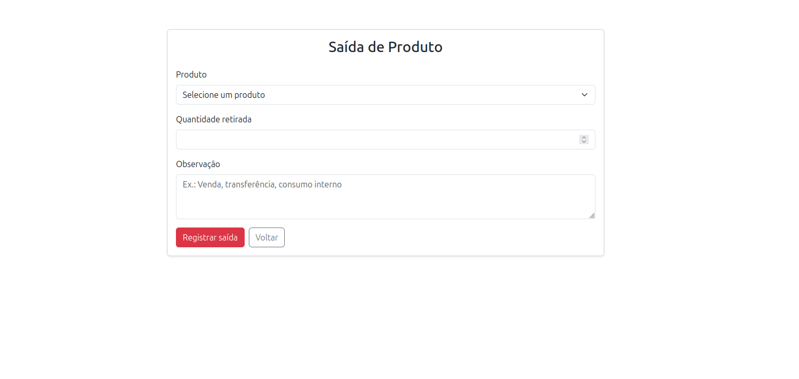
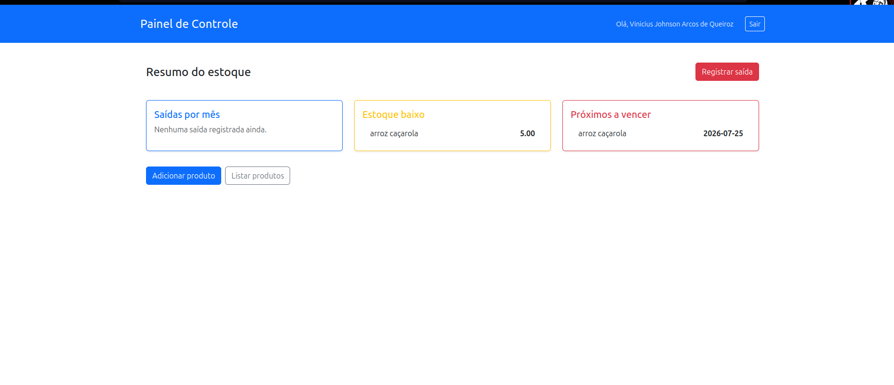

# Cadastro e Listagem de Produtos

Sistema de gestão de produtos em PHP com arquitetura MVC, utilizando **Slim Framework 4**, **Twig** e **MySQL**. Permite cadastrar, listar, editar, excluir produtos, registrar saídas e visualizar um dashboard com resumo do estoque.

## Funcionalidades

- Autenticação (login/cadastro de usuário)
- Cadastro de produtos (nome, código, quantidade, unidade de medida, validade)
- Listagem de produtos com ações de editar/excluir
- Edição de produtos com formulário preenchido
- Exclusão de produtos
- Registro de saída de produtos com validação de estoque
- Dashboard com resumo de:
  - Saídas por mês (armazenado em sessão)
  - Produtos com estoque baixo (≤ 5 unidades)
  - Produtos próximos da validade (próximos 30 dias)

## Tecnologias

- **PHP 8.x** com PDO e MySQL
- **Slim Framework 4** (rotas, PSR-7/PSR-15)
- **Twig** (templating)
- **Bootstrap 5** + **Bootstrap Icons** (frontend)
- **Docker Compose** (PHP-FPM, Nginx, MySQL, phpMyAdmin)
- **Composer** (autoloading PSR-4)

## Estrutura do projeto

```
app/
  controllers/    # AuthController, ProductController, UserController
  core/
    database/     # Connection (PDO singleton), DAO, Entity, EntityManager
  models/
    products/     # ProductModel, ProductEntity
    user/         # UserModel, UserEntity
  routes/
    web.php       # Definição de todas as rotas
  service/        # AuthService, ProductService, SessionService
  views/          # Templates Twig (auth, product, user)
config/
  database.php    # Configuração do banco via variáveis de ambiente
database/
  dump.sql        # Schema + seed data
  migration.sql   # Script de migração (validade → data_valid)
public/
  assets/
    css/          # Bootstrap CSS
    js/
      auth/       # app-auth.js (toggle senha), form.js (validação)
      product/    # product-form.js, outflow-form.js
    bootstrap-icons-1.13.1/
  index.php       # Entry point
tests/            # Testes funcionais básicos
docker/           # Dockerfile, nginx config
docker-compose.yml
```

## Requisitos

- PHP 8.x com extensão `pdo_mysql`
- Composer
- MySQL 8.x
- Docker (opcional, para ambiente containerizado)

## Instalação (manual)

```bash
git clone https://github.com/raposonaumpegue/cadastro_e_listagem_de_produtos.git
cd cadastro_e_listagem_de_produtos
composer install
```

Configure o banco:

```bash
mysql -u root -p -e "CREATE DATABASE sistemaDeCadastroElistagem;"
mysql -u root -p sistemaDeCadastroElistagem < database/dump.sql
```

Ajuste as credenciais em `.env` ou via variáveis de ambiente:

```env
DB_HOST=localhost
DB_USER=estudante
DB_PASSWORD=2467
DB_NAME=sistemaDeCadastroElistagem
```

Inicie o servidor embutido do PHP:

```bash
php -S localhost:8000 -t public
```

Acesse `http://localhost:8000/`.

## Instalação (Docker)

```bash
docker compose up -d
```

Serviços:
- **App:** http://localhost:8000
- **phpMyAdmin:** http://localhost:8081

## Rotas

| Método | Rota | Descrição |
|--------|------|-----------|
| GET | `/` | Login |
| POST | `/login` | Autenticar |
| GET | `/register` | Cadastro de usuário |
| POST | `/register` | Criar usuário |
| GET | `/logout` | Sair |
| GET | `/home` | Página inicial |
| GET | `/dashboard` | Painel de controle |
| GET | `/create-product` | Formulário de cadastro |
| POST | `/register-product` | Salvar produto |
| GET | `/list-products` | Listar produtos |
| GET | `/edit-product/{id}` | Formulário de edição |
| POST | `/update-product` | Atualizar produto |
| GET | `/delete-product/{id}` | Excluir produto |
| GET | `/outflow` | Formulário de saída |
| POST | `/outflow` | Registrar saída |

## Melhorias recentes

- Coluna `validade` renomeada para `data_valid` (consistente com schema atual)
- `un_medida` alterado para `ENUM('KG','UN','PCT','FD','CX')`
- Validação frontend extraída para arquivos JS dedicados
- Correção de caminhos relativos de assets (agora absolutos `/assets/...`)
- Remoção de classes e arquivos não utilizados (ConnectionDB, ExceptionRota, ProductDao, Dump)
- Limpeza de métodos mortos e código comentado
- Reestilização dos formulários com Bootstrap + ícones
- Dashboard com filtro de produtos próximos à validade

## Screenshots










## Licença

MIT
